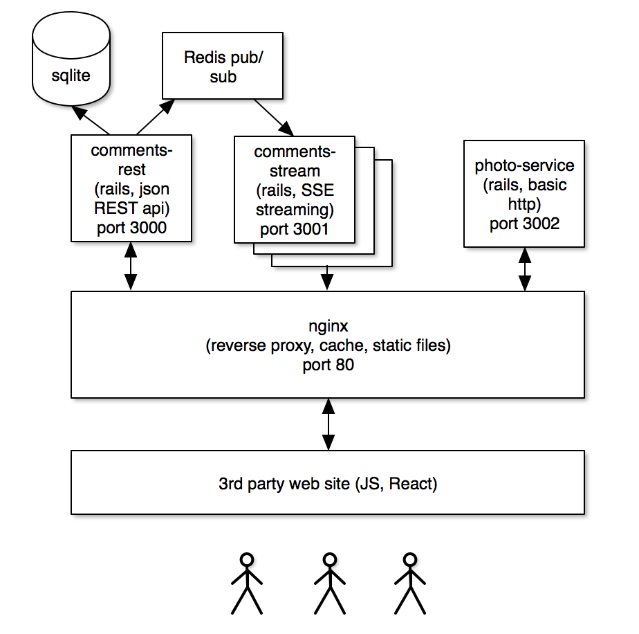

# shoutbox

Shoutbox is a lightweight comments widget that developers can easily embed in their web sites.  It supports real time
streaming of new comments as they are submitted by other users.
Each comment thread is specific to the URL it is on, allowing for easy use across multiple sections of your web site.


It is built on a rails-based microservices architecture with UI components built in react.js.



There are 3 main services:

## Comments REST service

This is a basic JSON REST API that allows users to create and list comments.
```
POST /comments.json {"name": "user name", "email": "email@address.com", "url": "http://www.foo.com", "photo_id": "abc123}
```

```
GET /comments.json?url=http://www.foo.com
```
Name, email, and url are required.  Photo ID is optional and served up by the photos service.

Comments are persisted in rails's basic sqlite database because it was easy and this is not meant for production.  Use a
real database if you want to run this in production.

When a comment is added, we send an event to a redis pub/sub channel named after the parent URL of the comment.  This is
how the REST service notifies the streaming service that new comments are ready.

## Comments Stream service

This is a service that uses HTML5 server-sent events (SSE) to stream comments to the client in real time.

When a stream is requested, it listens to the corresponding redis channel and pushes every comment it gets to the user.
Due to long-running connections, it may be necessary to run multiple instances of this in production and have nginx
load balance between them

```
GET /stream?url=http://www.foo.com
```

## Photo Service

This is a simple service that allows users to upload photos.  Each photo is stored in a hash-partitioned database on
disk, and requests to get a particular photo will redirect to a static location served and cached by nginx.

```
>>> POST /photo (file data)
<<< {status: "ok", id: "some_guid.jpg"}
>>> GET /photo?id=some_guid.jpg
<<< 302 /photoUploads/some_hash/some_guid.jpg
```

This doesn't do a lot currently, but future iterations could handle common tasks like resizing the photos, stripping
metadata, etc.

## React Widget

This is the piece that gets dropped into a customer's web site, i.e.
```
<script src="http://localhost/ui/shoutbox.js"></script>
...
<div id="put_box_here"></div>
<script>createShoutbox("http://localhost" /* base URL of your shoutbox server */, "put_box_here" /* id of element to
fill with widget */);</script>
```

It starts by fetching all existing comments via the REST API, then it opens an SSE request to the streaming service to
listen for new comments.
When a user submits a comment, it is POSTes to the REST API.

